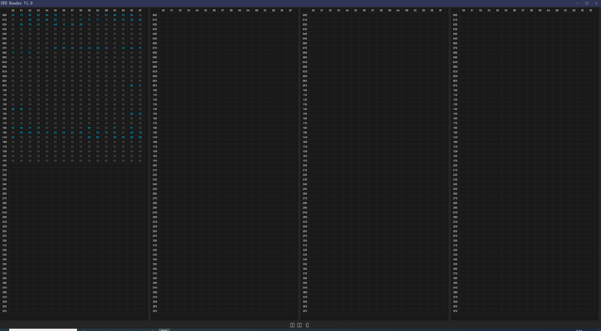
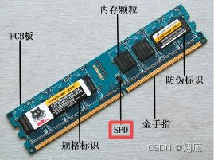
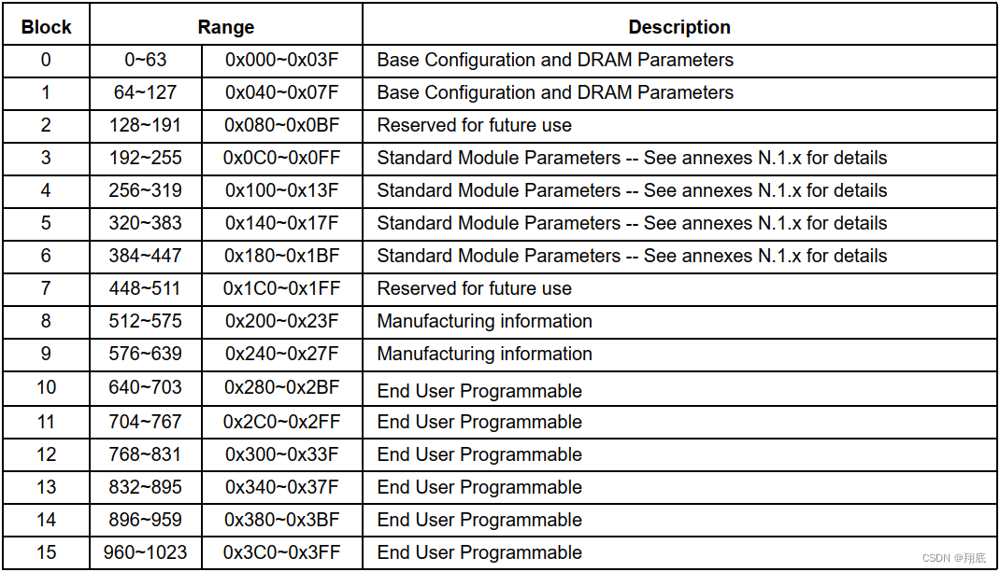
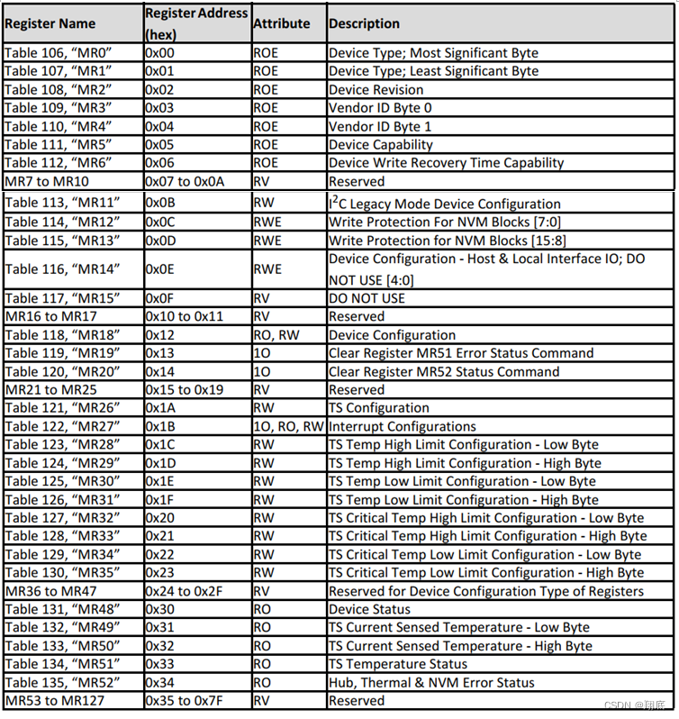
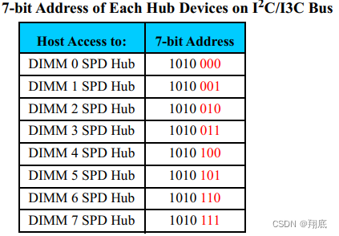
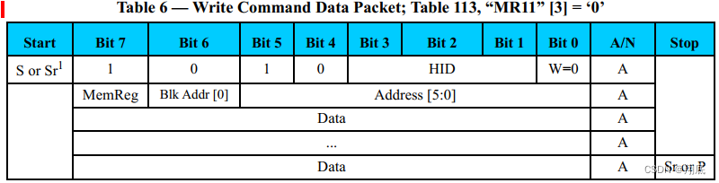
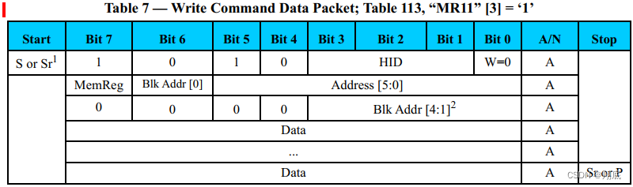
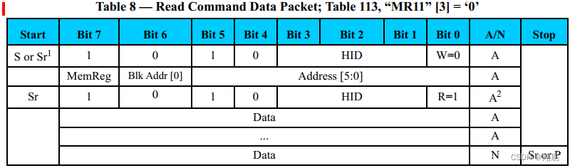
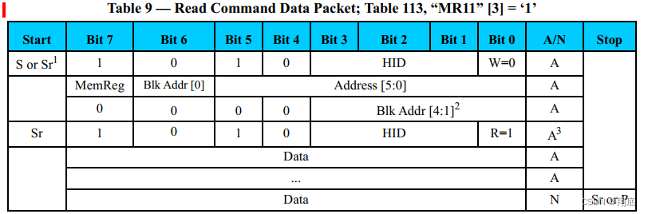
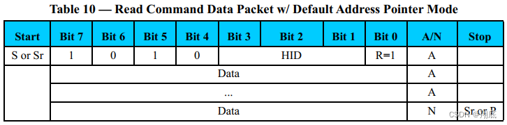

# SPDReader

#### 介绍
SPDReader是一款透过SMBUS Controller读取内存SPD信息的tool. 
1.支援Intel,AMD  
2.支援DDR4,DD5  
你可以通过这款tool 学习到SPD的读取方法.    

#### SPD 介绍
SPD（serial presence detect），即串行存在检测，是DIMM的相关描述信息。

在每根内存条上，都有一份SPD数据，这份数据保存在一个可擦写的eeprom芯片中。SPD数据记录了该内存的许多重要信息，诸如内存的芯片及模组厂商、工作频率、工作电压、速度、容量、电压与行、列地址带宽等参数。SPD数据一般都是在出厂前，由DIMM制造商根据内存芯片的实际性能写入到eeprom芯片中.  

SPD 中的数据主要是供 BIOS 在引导阶段给初始化内存时使用的，如果数据有误或者没有数据将导致内存初始化失败。随着技术发展尤其是 CXL 技术的发展，出现了多种支持 DDR 扩展的外设，这种情况下 SPD 还可能被外设的 fw 读取来进行初始化内存。

注：如无特别说明，本文档基于 SPD5 进行说明。

# EEPROM 数据
不同类型的DDR，他们的SPD数据长度和格式可能会不一样，比如：

DDR2、DDR3的DIMM，对应的SPD数据长度为256B；
DDR4的DIMM，对应的SPD数据长度为512B；
DDR5的DIMM，对应的SPD数据长度为1024B.  

# SPD 寄存器
前面描述的 1KB 内容是 EEPROM 的数据，这些数据保存了关于 SDRAM 和 DDR 的配置和性能信息等。对于 SPD 和 EEPROM 本身，还有128个寄存器（每个寄存器 8bits） "MR0 - MR127" 来进行描述和配置.  

# I2C 访问 SPD
访问 SPD 指的是访问 SPD 内的寄存器或者 EEPROM。前面的内容提到，SPD5 有128个配置寄存器，一个 1KB 大小的 EEPROM，这两者空间的偏移都是从 0x00 开始（寄存器：0x00 - 0x7F，EEPROM：0x000 - 0x3FF）。但是这两个空间又同时不在系统的 MMIO 空间中，要使用 I2C/I3C 协议来对它们进行访问，此时如何区分这两个空间就很关键了.

# SPD5 Slave Address
系统软件对 SPD 的访问一般是通过 I2C/I3C 协议来进行的，SPD 作为 Slave device MIPI 分配有固定的 address。SPD 的 7-bit Address 中高 4 位固定为 ‘a’，低 3 位根据 Hub 的不同有不同的值。其地址分配如下：  

# I2C Slave Protocol - Host to SPD5 Hub Device
前面提到的 EEPROM 和 SPD Registers 都属于 SPD5 Hub Device 本身的内容，所以它们使用的 Slave Address 就是 0xaX。后面我们我们还将看到 PMIC 和 RCD 等内容则属于 SPD5 Hub Local Device，此时可以将 SPD5 理解为一个 Hub，其下还可以挂接不同的 PMIC 和 RCD 等作为下游设备挂接到 SPD5 Hub 下，理所当然地它们拥有不同的 Slave Address.

I2C 访问 SPD5 Hub Device 和 访问 SPD5 Hub Local Device 使用的协议包格式是不一样的，这里主要讲前者。

前面讲 MR11 寄存器时有提到，SPD5 支持两种地址模式，默认情况下采用的是 2bytes 模式.如果主动修改，也是可以使用 1byte 模式的，但只能应用于 SPD5 Hub Device，不能应用于 PMIC 和 RCD 等。所以 I2C 协议的数据包也会有两种格式。

SPD 寄存器和 EEPROM 的偏移都是从 0 开始的，所以数据包中定义了一个 MemReg bit 来表示访问的是哪一个区域。
注：SPD4 或之前只有 1byte 模式一种.

# Write Operation - Data Packet
MemReg = 0 ： 访问 SPD 寄存器，此时 Blk Addr 被当作高位地址
MemReg = 1 ： 访问 EEPROM

1byte mode write  

 这是 1bytes 模式下，Host 写操作的数据包，只取 Address 的低 6 位，Blk Addr[0] 表示取 page 的低 128bytes 还是高 128bytes。由于最多只能访问 256 bytes，要访问其他 EEPROM 位置需要首先向 MR11[2:0] 写入对应的 page 值。

注：这里的 Blk Addr[0] 和 Address[5:0] 可以看作一个 Address[6:0]，这样就避免了分两个位置的麻烦。

其流程如下，注意 Start/Ack/Stop 等信号由硬件发出，不需要程序员参与：

Host 发送 Start 信号 + Slave Addr；
SPD 回 Ack；
Host 发送要写入的地址： [MemReg, Blk Addr[0], Address[5:0]]
SPD 回 Ack；
Host 发送要写入的数据 1byte；
SPD 回 Ack；
如果写多个数据，重复步骤5和6，此时数据会依次写入 Address 后面的地址；
Host 发送 Stop，结束通信。

2bytes mode write  

可以看到，Address被划分到两个字节中，其中[6:0]与 MemReg 组成第一个字节，剩下的[10:7]保存在第二个字节内。对于 SPD5，2bytes 模式下会将地址限制在 1KB 以内（即0x0 - 0x3FF，地址占 10bits），所以这里的 Blk Addr[4] 的值是无效的。

流程如下：

Host 发送 Start 信号 + Slave Addr；
SPD 回 Ack；
Host 发送地址第一个字节 [MemReg + Address[6:0]]；
SPD 回 Ack；
Host 发生地址第二个字节 [Address[10:7]]；
SPD 回 Ack；
Host 发送要写入的数据 1byte；
SPD 回 Ack；
如果写多个数据，重复步骤5和6，此时数据会依次写入 Address 后面的地址；
Host 发送 Stop，结束通信。

# Read Operation - Data Packet
使用 I2C 进行读操作时，先写入读取地址，再发起第二次通信进行数据读取。读数据时根据协议要求，第一字节 bit0 应该置1，但这是硬件会去完成的操作，对于软件，我们在写入第一个包后，只需从 I2C 数据寄存器中读取内容即可。

除了第一个消息中不包含要写入的数据，以及写完之后多一个读数据寄存器的步骤，读的操作与写操作基本一致，也通过 MemReg bit来表示读取 EEPROM 或 内部寄存器。

1byte mode read  

我们只要关注前面 W=0 的部分即可。

2bytes mode read  

Default Read Address Pointer Mode
除了上述两种读模式之外， SPD5 还提供了一个叫做“默认读”模式，主要是为了提高从同一地址读取关键数据的效率。在这种模式下，只要发送 Slave ID + 读取命令，不需要写入地址即可从某一地址连续读取数据。该地址在 I2C 初始化时即被写入到寄存器 MR18 中，且只能读取寄存器区域的内容。  

    

 相比于 2bytes mode，这种模式可以节省2个字节的包长度。

